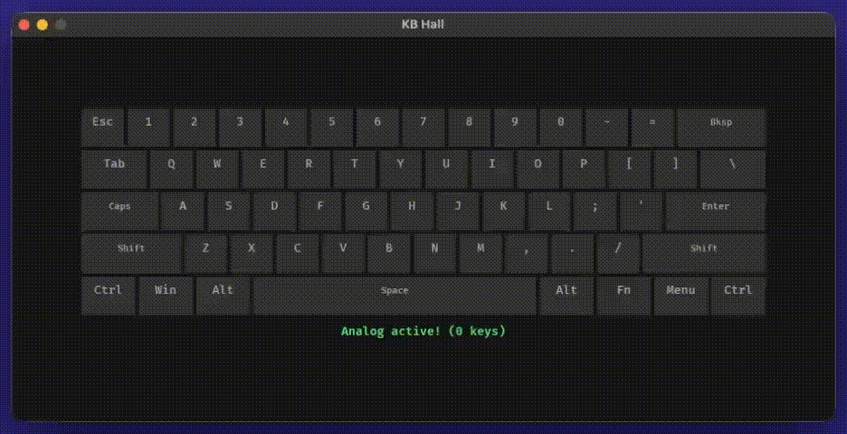

# KB Hall

Analog keyboard visualizer for MCHOSE Magnetic keyboard.

Reads per-key analog values (0-100% press depth) via WebHID and renders a real-time heatmap in a Bevy.

<div align="center">

</div>

## How it works

```
Keyboard (HID) --> Chrome (WebHID) --> WebSocket --> Bevy
```

The keyboard uses a proprietary HID protocol, so direct access requires WebHID (Chrome-only).
A tiny bridge page opens automatically, connects to the keyboard, and streams analog data over a local WebSocket.

## Requirements

- Rust 1.75+
- Google Chrome (for WebHID bridge)
- MCHOSE keyboard with Hall Effect switches (tested on Ace 60 Pro)

## Run

```sh
cargo run
```

Click **Connect** in the Chrome tab that opens, select your keyboard, done.

## Use as a library

The analog input logic lives in `src/lib.rs` and has no Bevy dependency.
Add `kb-hall` as a dependency and use `AnalogKeyboard`:

```rust
use kb_hall::AnalogKeyboard;

let kb = AnalogKeyboard::new(0x41e4, 0x2103); // VID, PID
kb.start();

loop {
    let values = kb.values(); // [f32; 256] indexed by HID scancode
    let space = kb.value(0x2C); // single key, 0.0..1.0
    println!("space: {:.0}%", space * 100.0);
}
```

## Project structure

```
src/
  lib.rs        - AnalogKeyboard API (reusable, no Bevy)
  main.rs       - demo visualizer (Bevy)
  bridge.html   - WebHID bridge page served to Chrome
```

## License

MIT
